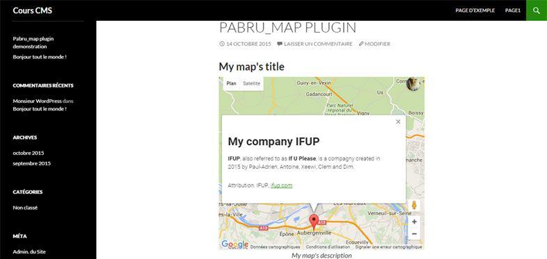

# PABRU-PLUGIN

Presentation
===========

plugin created as part of CMS course taught in my school.

This plugin enables you to create and display customized maps.

**You can already add :**
- an address (required)
- a map title
- a description of the map
- a title in the context box (of the marker, you just have to click on it to display the box)
- a text in the context box (of the marker)
- a link at the end of the context box (of the marker)

**Version 1.0, soon you will have more choices and cool features !**
*This plugin is indeed destined to evolve !*

[Visit My Portfolio] (http://pa-bru.com/)

[Visit My Linkedin] (https://fr.linkedin.com/in/pauladrienbru)

Basic Usage
===========

1. Download the plugin on my github repository
2. Install and activate it in your wordpress
3. Click on *add a new map*
4. Fill in the fields (just the Address field is required, the rest is optional but recommended)
5. publish or update the map 
6. copy the shortcode shown like `[pabru_map_shortcode id=1]`
7. Paste that one in the post/page you want to display the map

Example
===========

